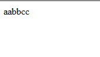
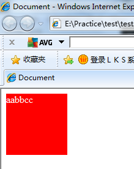
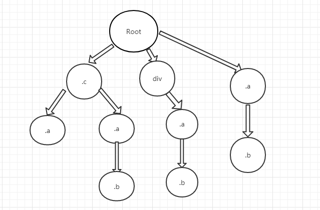

#Imooc imatate practice  

##总结  

- 这次模仿Imooc首页制作持续了一个多月，主要是这半个月在进行N301项目的开发，导致这个写的有点慢。但是总的来说收获还是很丰富的。
- 相比第一次进行仿写页面功能齐全了许多，之前很多东西不知道怎么实现，这次能看到的交互全部实现了。基础的排版错误减少了。在写Imooc首页的时候查阅了很多的资料，学习了很多各方面的知识。从html、css、js方面分开总结如下

### HTML

- html方面主要是学习了H5的一些标签和属性的运用，因为要兼容IE8，所以采用的比较少，然后兼容是使用h5shiv.js这个库来实现的。稍微了解了一下h5shiv的工作机制：参考连接 [https://www.xxling.com/blog/article/41.aspx](https://www.xxling.com/blog/article/41.aspx)  
源码链接 [https://github.com/aFarkas/html5shiv/blob/master/src/html5shiv.js](https://github.com/aFarkas/html5shiv/blob/master/src/html5shiv.js)    
源码注释非常的多（和代码量差不多，源码总共才300行，空行和注释大概有一大半），写的逻辑也很清晰，这种代码风格可以学习一下。
  
1.首先是如何检测浏览器是否支持HTML5标签的样式，通过创建一个标签，然后检测标签中是否有html5的新属性（源码用的是a标签的hidden属性）("hidden" in a)若为true则说明支持，否则不支持。  
2.然后是如何检测浏览器是否支持Html5标签，通过向刚才创建的a标签里添加一个自定义子标签，通过a.childNodes.length来判断  IE8及以下返回为0，其余为1
3.最后通过对document.creatDocumentFragement方法中的三个属性cloneNode createDocumentFragment createElement 来判断是否支持html5标签。  

- 检测完毕后 如果不支持html5标签样式则向&lt;head&gt;标签里添加H5的css样式。如下图所示，可以看到IE8里head里被插入了一个样式表。这个样式表是为了初始化h5的样式，因为h5标签默认为内联标签  

- 如果不支持html5标签则通过document.creatElement来一一创建一次h5的标签。只要在document里创建过一次对象后，后续的样式就能正常的应用在h5标签上了。为了验证这一过程，做个简单的实验  
	代码：
	<body>
	 	&lt;xyz&gt;aabbcc&lt;/xyz&gt;
	</body>
	样式：
	&lt;style type="text/css"&gt;
        xyz{
            display:block;
            height:100px;
            width: 100px;
            background-color: red;
            color:#fff;
        }
    &lt;/style&gt;
IE8下显示效果：  
  
添加script ：  
	document.creatElement("&lt;xyz&gt;&lt;/xyz&gt;");
IE8下显示效果：  
  

- 知识点1 documentFragment，在平时经常会遇到循环里往某个节点一直添加新的节点的情况 e.g:    
	for(var i = 0;i < 10;i++){  
	  var node = document.creatElement("&lt;a&gt;&lt;/a&gt;");
	  document.body.append(node);  
	}
这样的情况下每次append都会引起整个页面的回流，消耗性能巨大。改写成如下情况。
	var d = document.createDocumentFragment();  
	for(var i = 0;i < 10;i++){  
	  var node = document.creatElement("&lt;a&gt;&lt;/a&gt;");  
	  d.append(node);  
	}  
	document.body.append(d);  
这样写则只会引起一次回流，就是append(d)的时候。可以把documentFragement理解成在document里的缓存碎片节点。

 
- 知识点2 Function()与eval()    
Function是类实例的封装对象，类似于String之于string。    
Function()可以通过 Function(arg1,arg2,...,argn,执行体);的结构构造一个函数，其中执行体为字符串，执行方式同eval，但是性能会比eval高很多，所以推荐使用Function()替代,而且Function中新var出来的变量在局部作用域中，不会造成全局污染。当然两者的可读性都不是很好，能不用最好不用。

-知识点3 h5shiv.js的写法  代码风格  
通过闭包(function(window,document){
})(window,document); 的方式将内容全部封装到一个立即执行函数里，然后通过window.html5 = html5 的方式将内部接口暴露出来。能避免全局污染，同jquery暴露出来的只有$和jQuery两个对象。  
整个函数的结构为  
(function(window,document){  
   part 1 : 变量声明；  
   part 2 : 检查H5支持情况 ，  立即执行函数  
   part 3 : 功能函数  
   part 4 : 暴露接口  
   part 5 : 函数入口	
})(window,document);  
看了一下家用OEM的很多模块代码也是用这种格式写的，jquery结构也差不多，这样结构会很清晰，便于维护和理解。

- 这次写html结构时，将html、css、js彻底的分离开来写了，html结构简化了很多，样式全部通过类来控制。表现与结构与逻辑相互分离开来。

##CSS
扩展：Sass；  
编译工具：koala；  
第一次使用sass编写css，有很多写的不好的地方(写了一半才发现写的有些问题)，当然也学到了很多新的知识;  
主要使用了sass中的嵌套、变量、父选择器等规则，熟悉了sass的一些语法及功能。  
###不好的地方：  
1. 嵌套使用过多，这样在写sass的时候确实很方便，前半部分都是这么写的。后来发现，这样会导致编译出来的css选择器很长，并且会有优先级问题（主要是这个问题），而且嵌套过多会导致css的选择性能降低(css选择器从右至左解析，例如#page>li css选择器会先去找所有的li元素，然后再找li元素中父元素为#page的元素，为什么是从右至左，见下面css知识点 1)  
2. 没有抽离公共模块，可以通过混入和继承等规则来抽离公共模块来解决一些模块重用度高以及兼容性的问题。在写这个仿写的时候只是单纯的把变量抽出来了，让风格可以进行配置。  
3. 有时候写了一些多余的样式，导致代码冗余，调试的时候才发现。

###进步
1. 学习了许多css的知识，以及排版布局的知识。
2. 解决了一些错位的问题。
3. 学习了一些css3的新属性及其应用
4. 使用了.htc这种让css3兼容ie的插件//但这样会降低页面显示效率，能肉眼看到元素加载时的变化。
5. 使用初始化的css出事各个标签，设置margin、pading、display等（之前G324P碰到过一个bug。body的高度不为100%）  
6. 了解和处理了css的一些兼容性问题  rgba、outline、border等  
7. 了解学习了css的哪些方面会引起页面的回流及重绘，了解了浏览器从加载到渲染的过程  
8. 右边的导航栏采用纯css的实现，了解了css多层选择器与伪类之间激活的关系。  
9. 左边有个动画切换的地方没有调好，有点生硬，需要再弄一下
10. 观察到imooc上很多图片都集成到一个图片上，然后查资料学习了css sprite技术。

###知识点
1. css选择器：  
   css选择器是从右到左进行解析的，而我们的常规的思维都是从左到右看过去的。为什么要设计成这样呢，其实很好理解。从DOM树的角度一看瞬间就能明白。假设现在有个样式：  
	div a b{...}  
	c a b{...}  
	a b{...} 
加入从左至右检查为了去找a b这个选择器，需要遍历整个DOM树，实际上无论找哪个选择器都要遍历DOM树然后遇到不匹配的地方需要回溯（相当于执行一次DFS深搜算法时间复杂度为O（N^m）N为DOM树分支平均节点数,m为选择器个数），若不这样，要是漏了一个a b怎么办？不就GG了。从右至左的话只会遍历一遍DOM树然后遍历相应节点的那条分支（时间复杂度O（k^m）k为最长的带有选择器的分支的深度）。两个复杂度都是自己粗略算的
	
再看一个
如果选择器为 ul li b{...}  
DOM树如下  
如果从右至左 则只需遍历一遍DOM树  
从左至右  遍历一遍DOM树，在遇到ul时往下找li，找到li是往下找b，发现b没有晦朔至ul，往下找下一个li。  
当然这是一种极端的情况，若最右边的选择器的正确匹配比较少时或者DOM树比较简单时，从左至右的性能可能比从右至左高。但平均来讲还是后者比较高效  
  

### 总结
总的来嗦，css方面的知识是在这次联系项目中学习和应用比较多的。实现了第一次仿写很多没有实现的功能及排版。解决了第一次重写中出现的许多bug。了解了很多css的知识以及相关的技术（amp sprite等）。收获颇丰。

##Javascript
- js总体没有用什么新的技术或者框架。学习了jq的ajax的api，后面会抽时间去看下xmlHttpRequest的通讯原理。看了一遍h5shiv.js的源码。
###进步
1. 各个模块分离开来，登录的逻辑封装在了一个类中，可以通过一个实例化的对象来调用，页面交互的逻辑封装在另外一个类中，便于理解和维护。
2. 通过window.localStorage和window.sessionStorage模拟了一下用户注册和用户登录，这两个都支持IE8，为什么不用这两个代替cookie呢？
3. 在N301项目中学习了sea.js的使用，写了一些笔记。就不贴在这里了。
4. 我觉得可以建立一个组内的文档放在SVN上，一些什么规范、分享什么的也可以放在上面，例如自测checklist，IE的兼容性问题什么的，可以做一个组内的输出，大家可以共享也可以一起维护。还可以上传不同项目的设计文档，后面其他人维护的时候有设计文档能更好的理解该项目的整体设计。（因为N301做了3个项目，开始有很多疑惑却没有任何文档说明一下，自己把公共库的函数打断点走了很多遍才理顺了其中的逻辑。）

### 不好的地方
1. 过多的使用jq的css方法去控制样式，最好能够使用类的方法来控制样式。以后会注意这一点。
2. 结构感觉还是不够清晰，还有优化的地方。

###
代码及总结已经上传到github上  
链接：[http://github.com/Zhuyi731/Imooc](http://github.com/Zhuyi731/Imooc)   
以后自己做的项目也会上传到git上，也方便自己在家和公司都可以做修改。
h5shiv和css的分享贴到自己博客上，记录一下。以后的一些笔记也记录一下，养成这个习惯。

